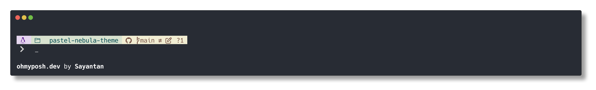

# Pastel Nebula Theme for Oh My Posh

A soothing pastel-colored theme for [Oh My Posh](https://ohmyposh.dev/), featuring soft color palette with excellent readability.

## Preview



## Features

- Soft pastel colors that are easy on the eyes
- Distinct segment colors for improved readability
- Git status information with visual indicators
- Support for Node.js and Python version display
- Command execution time
- Status indicators for command success/failure

## Installation

### Prerequisites

- [Oh My Posh](https://ohmyposh.dev/) installed
- A [Nerd Font](https://www.nerdfonts.com/) installed and configured in your terminal

### Manual Installation

1. Download the `pastel-nebula.omp.json` file
2. Add the following to your shell configuration file (update the path accordingly):

**For Bash (~/.bashrc):**
```bash
eval "$(oh-my-posh init bash --config /path/to/pastel-nebula.omp.json)"
```

**For Zsh (~/.zshrc):**
```zsh
eval "$(oh-my-posh init zsh --config /path/to/pastel-nebula.omp.json)"
```

**For PowerShell ($PROFILE):**
```powershell
oh-my-posh init pwsh --config "/path/to/pastel-nebula.omp.json" | Invoke-Expression
```

3. Restart your terminal or source your configuration file.

## Customization

Feel free to modify the theme to your liking by editing the JSON configuration. You can change colors, add or remove segments, and more.

## Credits

Created by Sayantan

## License

MIT
